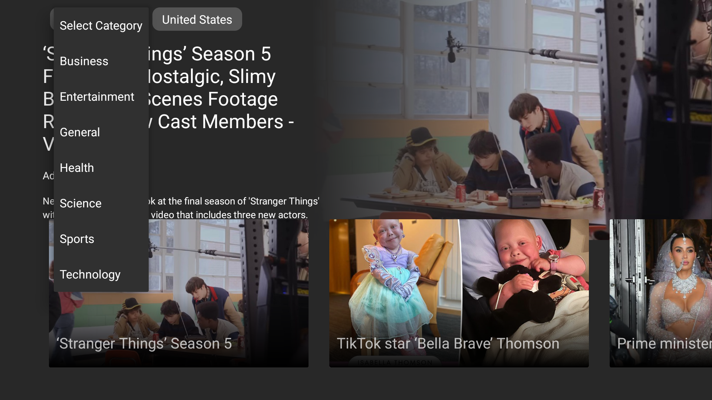
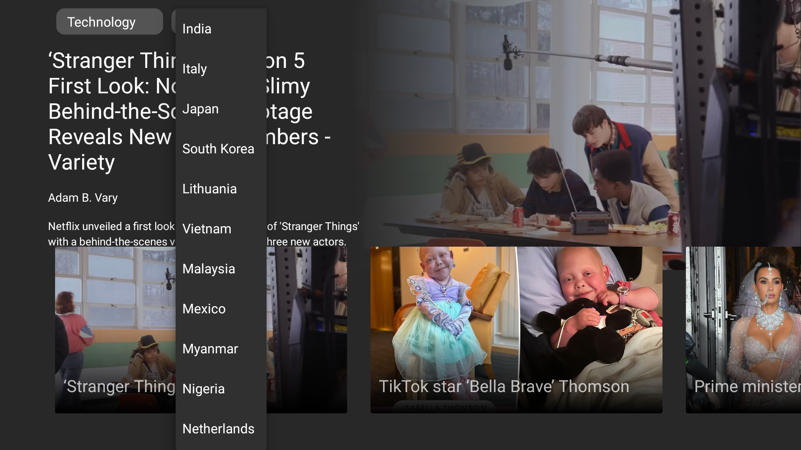
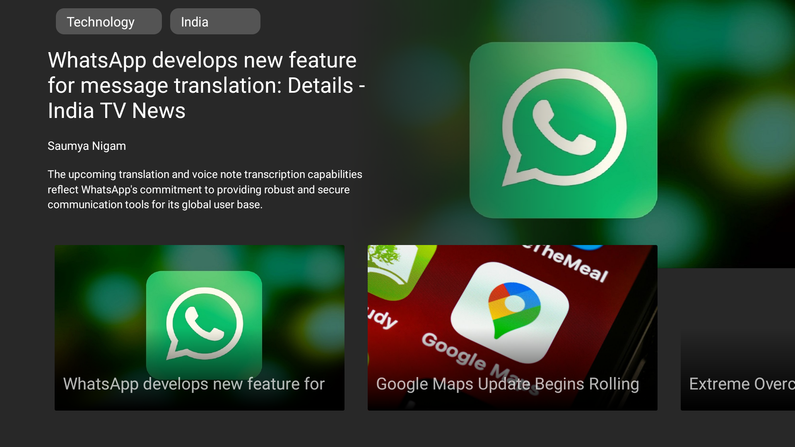

# CircuitHouseAssignment

News App for Android Tv made as an Assignment.

## Tech Stack Used

- Kotlin
- MVVM
- Dagger-Hilt
- Glide
- Retrofit

## Screenshots and Demo

## Steps to Install the app.

1. Clone the project.
2. Open the project in Android Studio.
3. Run in the Emulator.
